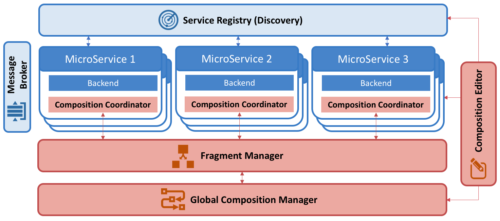

# Microservice composition based on the Choreography of BPMN fragments. Infrastructure

This repositry contains a software infrastructure to create a choreographed composition of microservices by using BPMN diagrams. 
An example using this infrastructure is available in the following Github repository: [microservices-composition-example](https://github.com/pvalderas/microservices-composition-example).

It has been implemented by using:

* [Spring Boot](https://spring.io/projects/spring-boot)
* [Netflix infrastructure](https://github.com/Netflix)
* [Camunda Engine](https://github.com/camunda/camunda-bpm-spring-boot-starter)
* [BPMN.io](https://github.com/bpmn-io)
* [RabbitMQ](https://www.rabbitmq.com/)

# About

This is the result of a reserach work leaded by Pedro Valderas at the PROS Research Center, Universitat Politècnica de València, Spain.

This work presents a microservice composition approach based on the choreography of BPMN fragments. On the one hand, developers can describe the big picture of the composition with a BPMN model, providing a valuable mechanism to analyse it when engineering decisions need to be taken. On the other hand, this model is split into fragments in order to be executed though an event-based choreography form, providing the high degree of decoupling among microservices demanded in this type of architecture. 

This composition approach is supported by a microservice infrastucture developed to achieve that both descriptions of a composition (big picture and split one) coexist. In this sense, microservices compositions can be evolved graphically from both either the BPMN descrition of the big picture or a BPMN fragment.

# The proposed architecture

The microservice architecture to support the choreographed composition of microservices through BPMN fragments is shown below.



The architectural elements that support our proposal are depicted in red. Thery are the following:

* Business microservices are complemented with a Compositon Coordinator in such a way a business microservice can be considered as the assembly of two main elements:  The Composition Coordinator, which is in charge of interpreting BPMN fragments in order to execute tasks and interact with other microservices; and the backend, which implements the functionality required to execute the tasks of each microservice. The Composition Coordinator endows each microservice with a PMN Editor based on BPMN.io in order to modify its BPMN fragment.
* The Global Composition Manager microservice, which is in charge of managing the big picture of a microservice composition. It stores the BPMN model that describes the complete composition. It also updates it when a microservice evolves its corresponding fragment. In addition, it is in charge of sending each composition to the Fragment Manager. The Global Manager is complemented with a BPMN Editor based on BPMN.io in order to create microservice compositions.
* The Fragment Manager microservice, which plays the role of gateway between the Global Composition Manager and the Composition Coordinator of each microservice. It is in charge of splitting a global BPMN composition into fragments, and distribute these fragments among the different Composition Coordinators.

# Creating a Global Composition Manager

To create a Global Composition Manager you just need to compile the corresponding project and include is as a dependency of a Spring Boot Application. Then, you just need to annotate the main class with the @GlobalCompositionManager as follows:

```java
@GlobalCompositionManager
@SpringBootApplication(scanBasePackages = {"es.upv.pros.pvalderas.globalcompositionmanager"})
public class GlobalCompositionManagerMicroservice {

	public static void main(String[] args) {
		SpringApplication.run(GlobalCompositionManagerMicroservice.class, args);
	}
}
```
Next, you must create an application.yml file, indicating the urls of both the Fragment Manager, and the Service Registry in which microservice are registered. Currently, only Netflix Eureka is supported as Service Registry. Other registries will be supported further.

```yml
server:
  port: 8084

composition:
  fragmentmanager:
    url: http://localhost:8083/compositions
  serviceregistry:
    url: http://localhost:9999/eureka-server
    type: eureka
```
 
# Creating a Fragment Manager

# Extending a business microservice with a Compositon Coordinator
